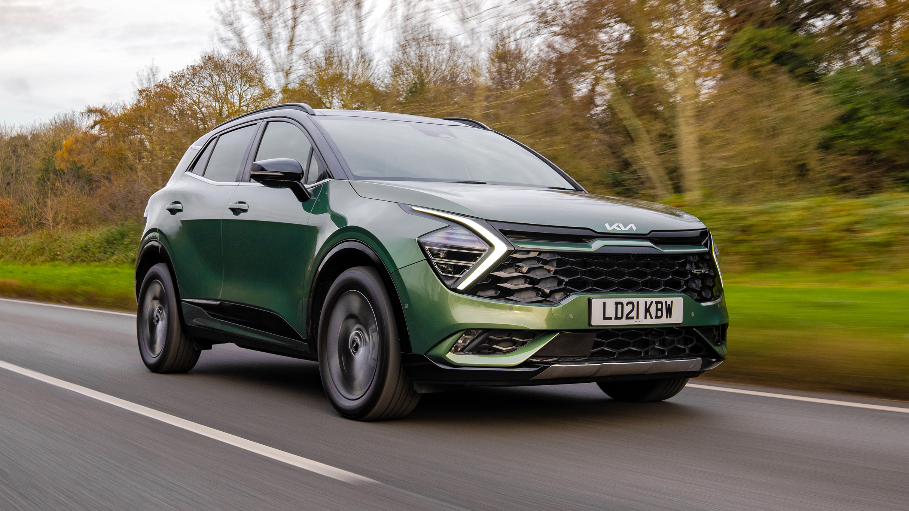
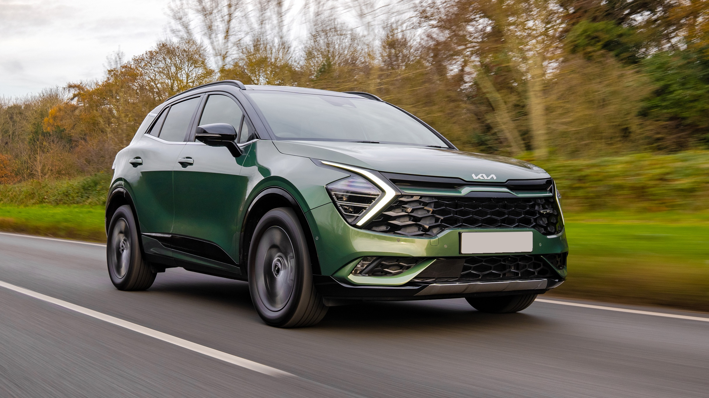

# License Plate Removal

This is a lightly customised fork of [JPLeoRX/license-plate-removal](https://github.com/JPLeoRX/license-plate-removal), which uses OpenCV and Pillow to detect and obfuscate vehicle number plates.

**Usage:**

```
> ./main.py
Usage: main.py [OPTIONS]

  Obfuscate the number plate in the given image.

Options:
  -s, --source PATH       Source image path.  [required]
  -d, --destination PATH  Destination image path. Default is
                          <source>_obfuscated.<ext>
  -f, --force             Overwrite the destination file if it exists.
  -h, --help              Show this message and exit.
```

## Examples

| Before                           | After                                       |
| -------------------------------- | ------------------------------------------- |
|  |  |
|   |   |

## Note

This method isn't always super reliable, and sometimes will simply fail.

The logic for plate detection is quite brittle and works by finding all rectangles with some best-effort tuning to reduce false positives, and then simply picking the largest rectangle found, so it's open to failure if there are large road signs or anything like that. Livery on police vehicles has also proven to be problematic.

If the lack of reliability becomes a problem for me, I may consider doing attempting to improve it, but until then it works well enough for me.

### Ideas for improvement

* Filter colours before performing edge detection. My focus is UK plates, so filtering for yellow & white would narrow it down a lot in most cases.
* Perform OCR, looking for text that constitutes a valid number plate. This could be further improved by performing further colour filtering, looking for black text on a white or yellow background.

### Alternatives considered

* https://github.com/syedrz/Face_and_LicensePlates_Anonymizer
* https://github.com/understand-ai/anonymizer (this seems to be a copy of the one above, maybe modified?)
* https://github.com/Maleehak/Car-number-plate-recognition-using-OpenCV

## Attribution

Thanks to [JPLeoRX](https://github.com/JPLeoRX) for their hard work on this! 

They wrote a [great tutorial](https://medium.com/@leo.ertuna/license-plate-removal-with-opencv-6649a3ac54e2) to go along with their [original source code](https://github.com/JPLeoRX/license-plate-removal).

They also wrote a cool blog post a couple of years later on the topic of more in-depth license plate detection. Worth a read [here](https://tekleo.net/blog/jump-start-in-object-detection-with-detectron2-(license-plate-detection))!
